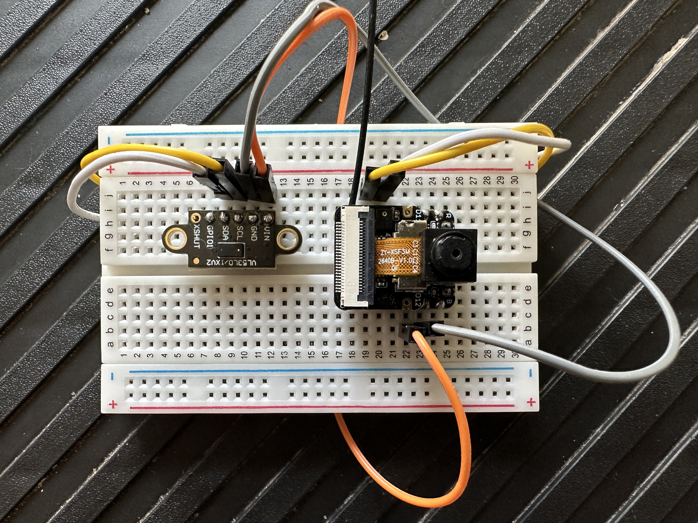

### Esp32s3-Sense/VL53L0X Gecko Motion Still Image Cam
>Seeed Studio XIAO ESP32S3 / ACEIRMC VL53L0X(ST)\



--- 

Leopard geckos hide a lot. Position the cam/sensor somewhere facing a spot the gecko may go during the day. If the gecko moves infront of the sensor then a photo will be captured->sent to local server->written to uploads folder.

# Includes

### Gecko Threshold calibration
The threshold is set using two values. One being the current range the sensor is reading. The other being lower/upper bounds based on the IC's +/-3% accuracy. The need for this is that at 900mm the reading will roughly jump around +/-27mm while at 200mm its only +/-6mm. This is why dynamic bounds are needed and can be realized very simply in the code. 

```C
    if (BaseThreshold * .03 > 15.5) {
      bounds = ceil(BaseThreshold * .03);
    }
```
A note on the first value used, the current range the sensor is reading is actually the average of 30 reads. Also the threshold calibration will run every 5000 reads to combat the vl53l0x's sensor drift over 2+ hours. The goal is to set and forget and this works. I do imagine a very small gecko (non leopard) may need the bounds reduced but then you run into the range fluctuation possibly causing dud images.

### Sending Images to Local Server
Given a wifi connection is made (device_wifi.c) and running the esp_server express server, after threshold bounds have been passed an image will be received here at localhost:port/uploads. On the esp32 side, a simple POST request is made containing the jpg frame buffer then the connection is cleaned up. This logic is at main/events/device_sender.c

### ESP32S3/VL53L0X initialization
Standard ESP32S3 I2C init from docs.

Standard VL53LOX init from docs with addition of sigma/signal checks. Checks are realized in sensor_active and threshold files, can just be removed to disable.

```C
    while (Status != VL53L0X_ERROR_NONE || RangingMeasurementData.RangeStatus != 0) {
      Status = VL53L0X_PerformSingleRangingMeasurement(Dev, &RangingMeasurementData);
    }
```

### Camera Initialization/Use
You will need the https://github.com/espressif/esp32-camera repo. I have included my cmakelist for that components dir to describe how its being used and the main/events/device_camera.c file consumes it to initialize the camera. In this file you can change many of the camera settings like quality/format etc. All camera controls have been set to auto.

This file also contains the function to take the image. One thing about this sensor is the first or first few photos do no have any calibration settings applied. So in the takeImage() function there is a loop that can take n photos as throwaways to ensure the photo used includes calibration settings.

>NOTE: I have also left the function call to send the photo in takeImage(), probably should be in main.c.

```C
  for(int i = 0; i < 1; i++) {
    camera_fb_t * temp_frb = esp_camera_fb_get();
    if (!temp_frb) {
      return ESP_FAIL;
    }
    esp_camera_fb_return(temp_frb);
  }
```

# Using

```plaintext
root/
│
├── main/
│   ├── events/
│   └── main.c
│
└── components/
    ├── vl53l0x-api/
    └── esp32cam-lib/
```
This basic structure is expected by the cmakelist files. shouldnt have to change anything but add the missing files to the esp32cam directory.

### idf.py menuconfig
  - psram Octal mode/update size for platform
  - main task stack size = 8192 (for networking else will overflow)

I used ESP-IDF 5.0.2. The state of this project is very MVP like. I left plenty of logs in the code. It all works fine but at this point a better sensor like the vl53l1x would be my next move. I would also try ultrasonic sensors because lighting conditions tend to affect these sensors.
